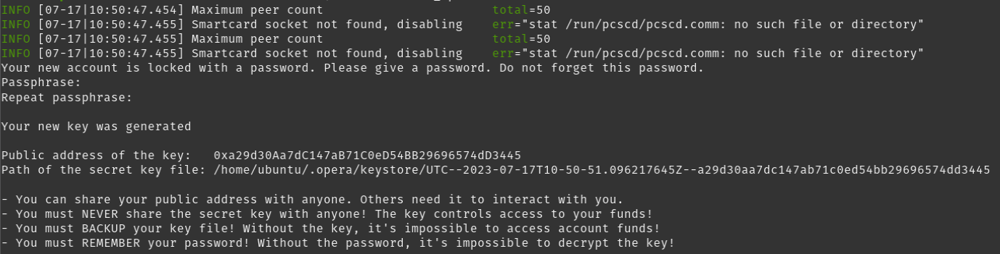
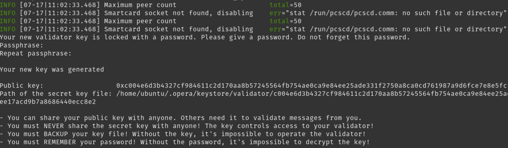
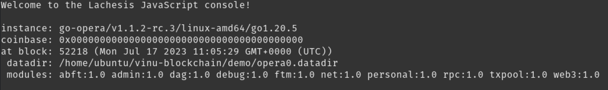
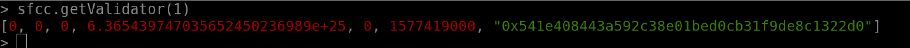
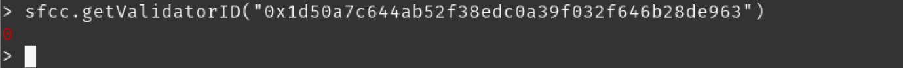
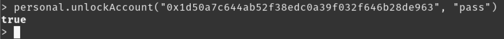
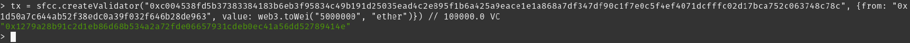
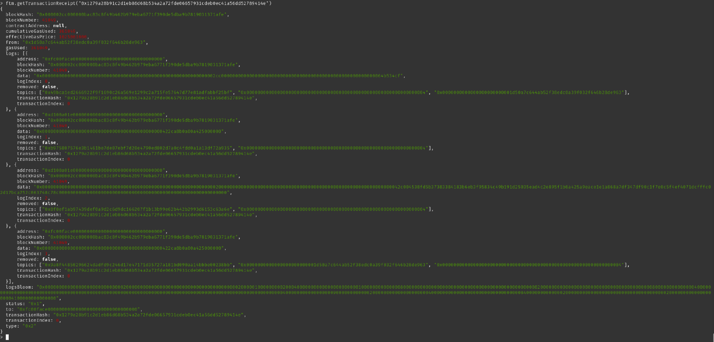
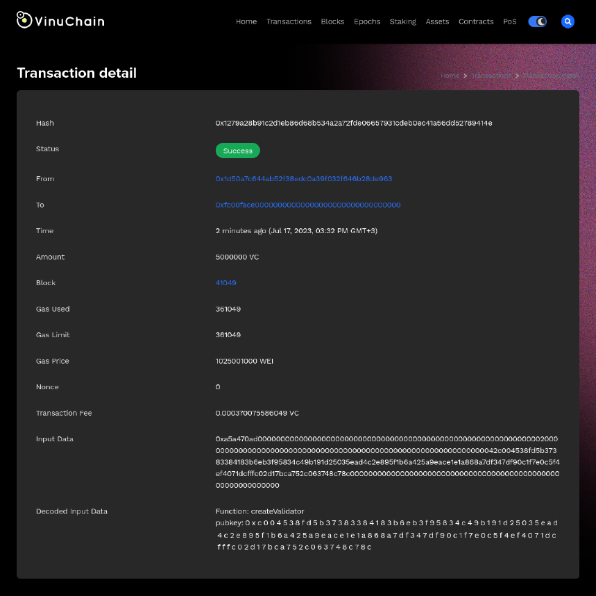
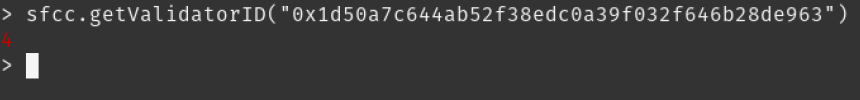

# Install Validator Node

## Validator Parameters

*   Minimum Staking Size:

    <pre><code><strong>200,000 VC
    </strong></code></pre>
*   Maximum Validator Size:

    ```
    15x the self-stake amount
    ```
*   Minimum Hardware Requirements:

    ```
    m6i.large or better (2 vCPUs, 8GB RAM), 200GB SSD
    ```
*   Unlock / withdrawal period (from when you undelegate; both must elapse):

    ```
    Validator self-stake: 180 epochs and 3 days.
    Delegations to the validator: 6 epochs and 1 day.
    ```
*   Rewards:

    ```
    Block rewards from self-stake + 15% of delegators' rewards.
    APY varies based on staked %.
    ```

## Validators

After installing a [Read-Only Node](read-only-node.md), you can upgrade to a VinuChain validator by registering your validator node on-chain. To do this, you need to have at least 200,000 VC to create a validator wallet. The wallet is the validator’s identity in the network which it uses to authenticate, sign messages, etc.

A validator is a network participant responsible for confirming and validating transactions, producing new blocks, and securing the network's consensus protocol. Validators play a critical role in maintaining the integrity and security of the VinuChain blockchain.

_**Validators receive block rewards for their contribution to the network.**_

_**If you have not installed your**_ [_**Read-Only Node**_](read-only-node.md) _**yet, please begin at the previous page!**_

## Create a validator wallet

The node is now running and syncing the network in your current console, so you need to open up a new console window, connect via **SSH** to the server and enter the following commands to **create a validator wallet:**

```
# Create validator wallet
(validator)$ ./opera account new
```

After entering the command, you will get prompted to enter a password for the account (= wallet) — use a strong one! You can e.g. use a password manager to generate a 20+ digit password to secure your wallet. It will look something like this:

<figure><figcaption></figcaption></figure>

NEVER share your private key or keystore with anyone!

### **Fund your validator wallet**

The next step is to fund your validator wallet with enough VC to become a validator. That means you need to have at least **200,000 VC** in the wallet you just created (send a little more to cover transaction fees). After successfully sending the VC to your newly created Opera wallet, you can **register your validator via the SFC Smart Contract.**

Make sure you wait for your node to be fully synced, otherwise your VC will not show up in your wallet!

## Create a new validator key

We have to create validator private key to sign consensus messages with. It can be done only using **go-opera**

```
(validator)$ ./opera validator new
```

<figure><figcaption></figcaption></figure>

Follow the prompts and supply the password, the output is as follows:

```
Your new key was generated

Public key: 0xPubkey
Path of the secret key file:

- You can share your public key with anyone. Others need it to validate
messages from you.
- You must NEVER share the secret key with anyone! The key controls
access to your validator!
- You must BACKUP your key file! Without the key, it's impossible to
operate the validator!
- You must REMEMBER your password! Without the password, it's
impossible to decrypt the key!
```

## Create your validator via the SFC

You should wait for your node to sync to the latest block of the network before proceeding.

### Attach to Opera console

To proceed, open up the console where you entered the commands to create the validator wallet previously and attach to the Opera node console:

```
# Attach to opera console
(validator)$ ./opera attach
```

By doing so, you will get a JavaScript console where you can directly interact with the Opera node and e.g. send transactions (which you will do in a moment):

<figure><figcaption></figcaption></figure>

### Initialize SFC

Fetch the current SFC ABI from the authoritative contract registry ([VinuChain/Vinuchain-Lists](https://github.com/VinuChain/Vinuchain-Lists)) and build a console script — run this on the host shell:

```bash
curl -L "https://raw.githubusercontent.com/VinuChain/Vinuchain-Lists/refs/heads/main/contracts/vinuchain/SFC_abi.json" -o "$HOME/SFC_abi.json"

python3 - <<'PY'
import json, os
home = os.path.expanduser("~")
abi = json.load(open(os.path.join(home, "SFC_abi.json")))
js = "var abi = " + json.dumps(abi) + ";\n"
js += 'var sfcc = web3.vc.contract(abi).at("0xFC00FACE00000000000000000000000000000000");\n'
js += 'console.log("SFC ABI loaded. Use sfcc.functionName(...)");\n'
path = os.path.join(home, "sfc_console.js")
open(path, "w").write(js)
print('Now run in the Opera console:  loadScript("%s")' % path)
PY
```

(The script lands under your home directory rather than world-writable `/tmp`, so another local user cannot swap it before you load it.)

then **load it inside the Opera console** by pasting the `loadScript` line the script printed (this initializes both `abi` and the `sfcc` contract object in one step):

```
loadScript("/home/YOUR_USER/sfc_console.js")
```

After loading the script, you can now interact with the network's SFC. The registry ABI tracks the deployed bytecode across SFC patch upgrades — always re-fetch it rather than pasting an ABI from an old guide or pastebin (stale ABIs are missing newer functions such as `reactivateValidator`).

### Sanity check

Enter the following command to check that everything works as expected:

```
// Sanity check
sfcc.lastValidatorID() 
// if everything is all right, will return a non-zero value
```

If it looks like this, everything is OK (you should not get an error here):

<figure><figcaption></figcaption></figure>

### Get your validator ID

Next, try to get your `ValidatorID` from the SFC using your previously generated validator wallet address:

```
# Get your validator id
sfcc.getValidatorID("VALIDATOR_WALLET_ADDRESS")
```

* Use quotes for "VALIDATOR\_WALLET\_ADDRESS".

This should return **0**, as you are not registered as a validator yet:

<figure><figcaption></figcaption></figure>

### Unlock validator wallet

Next, unlock your validator wallet to be able to execute the registration transaction (make sure to use the password you set before).

Note that, you can perform this step (unlockAccount + createValidator) in a separate machine (different from the machine you'll run your validator node), or it'd be even more secure if you use hardware wallet to do it.

```
# Unlock validator wallet
personal.unlockAccount("VALIDATOR_WALLET_ADDRESS", "PASSWORD", 300)
```

* Use quotes for "VALIDATOR\_WALLET\_ADRESS" and "PASSWORD".

This will return “**true**” if unlocking the wallet was successful:

<figure><figcaption></figcaption></figure>

### Register your validator

Next, send the `createValidator` transaction to register your validator **(the value is the representation of the smallest VC unit, so it must be divided by 1e18.**

Alternatively, you can use `web3.toWei("200000.0", "vc")).`

```
# Register your validator
tx = sfcc.createValidator("0xYOUR_PUBKEY", {from:"0xYOUR_ADDRESS", value:
web3.toWei("200000.0", "vc")}) // 200000.0 VC
```

* Use quotes for "0xYOUR\_PUBKEY" and "0xYOUR\_ADDRESS".
* 0XYOUR\_ADDRESS refers to the wallet created on the validator.
* `0xYOUR_PUBKEY` MUST be the **canonical 66-byte lachesis-base format** — paste the `Public key:` value from the `opera validator new` output verbatim. The string starts with `0xc004…` and is 134 characters long including the `0x` prefix. Do not strip the `0xc0` type-byte or hand-construct the value: the canonical format is `0xc0` (Secp256k1 type byte) + `0x04` (uncompressed-key marker) + 32-byte X coordinate + 32-byte Y coordinate. The SFC contract rejects any other shape with `"invalid pubkey length"` or `"invalid pubkey type"`. A validator registered with a malformed pubkey cannot produce verifiable consensus events and any stake delegated to it earns zero rewards.

<figure><figcaption></figcaption></figure>

### Check your registration transaction

Make sure to check your registration transaction (could take a few moments to be confirmed):

```
# Check your registration transaction
vc.getTransactionReceipt(tx)
```

Look for the **status: “0x1”** at the bottom, which means the transaction was successful:

<figure><figcaption></figcaption></figure>

You can also copy the `transactionHash` and go to [VinuExplorer](https://vinuexplorer.org) to check your transaction there:

> https://vinuexplorer.org/tx/\[YOURTX]

This would look something like the below:

<figure><figcaption></figcaption></figure>

### Check your validator ID

Finally, execute the following command again to check your `validatorID`:

```
# Get your validator id
sfcc.getValidatorID("VALIDATOR_WALLET_ADDRESS")
```

It should now return something other than “**0**”:

<figure><figcaption></figcaption></figure>

Congratulations, you are now a VinuChain validator!

Close the Opera console window by typing “exit”.

## Run your VinuChain validator node

### Restart your node in validator mode

Before you run off celebrating, you need to **restart your node in validator mode**!

Make sure your node is already synced to the latest block in read mode, and it's synced in --syncmode full.

* Stop the opera process (read mode):

```
pkill opera
```

or

```
(validator)$ sudo killall opera
```

* Create an **empty file** and paste **validator node password** into it.

Then head back to the console window where you started your node with the following command:

**Mainnet:**

```
nohup ./opera 
--bootnodes "enode://678f242c2d60ed433c23bba0f9ea00982ea9bc5eb1d7f91337c23ccec5f41c9634705fa79994ba8f62ee893574451631a10f694cfa684f75524de79a7e50f890@54.244.138.80:3000,enode://e0d777bf4ef6318a748ffbd2c58d3b664f5132a02d711567a6df378504c49edbc3145b8f0105ea100988bd1bb57ac574a783d255b2b57abd65a5f0ae13954e77@35.161.54.139:3000" 
--validator.id ID 
--validator.pubkey VALIDATOR_PUBKEY 
--validator.password PATH_TO_PASSWORDFILE > validator.log &
```

**Testnet:**

```
nohup ./opera 
--bootnodes enode://e2a95c1b8d85b018b8e88133bec342801b42e19b59a52e030462d04a5549f02fc57215b4ca97771ec6b3a0d30a78603fdccd2b5091c44f6ac439d6c8be8bc539@44.239.129.39:3000
--validator.id ID 
--validator.pubkey VALIDATOR_PUBKEY 
--validator.password PATH_TO_PASSWORDFILE > validator.log &
```

* You must replace `ID` & `VALIDATOR_PUBKEY` & `PATH_TO_PASSWORDFILE` variables with your own values.

## Update validator info

### Name & Logo

If you'd like to set up a Name and logo for your node, please go to [update-validator-info.md](update-validator-info.md "mention")
