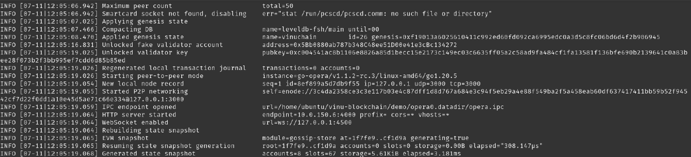
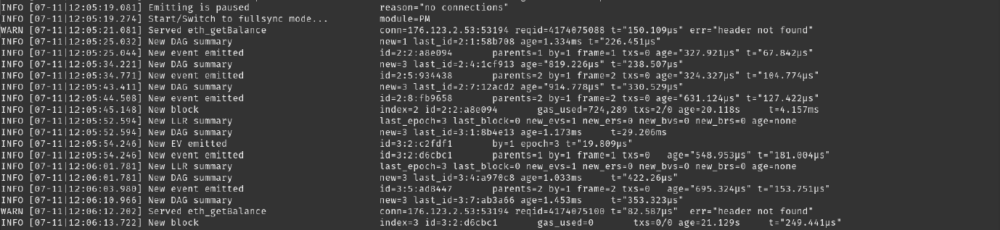

# Read-Only Node

## Read-Only Nodes

Read-Only Nodes are nodes that do not participate in the consensus process. Instead, they connect to full nodes or the network's APIs to retrieve information from the blockchain.&#x20;

Read-only nodes can be used for various purposes, such as querying transaction history, checking account balances, and monitoring network activity.&#x20;

They are "read-only" because they cannot write or create new transactions on the blockchain; they can only read and display data.

_**You must install a read-only node before you can upgrade to a validator node!**_

## Launch cloud instance

You can either run a node on your own hardware or use a cloud provider.&#x20;

We would recommend choosing one of the big cloud providers, e.g. Amazon AWS.&#x20;

### **Node Specifications**&#x20;

We recommend the following or better:&#x20;

m5.xlarge General Purpose Instance with 4 vCPUs (3.1 GHz), 16GB of memory, up to 10 Gbps network bandwidth, and at least 500 GB of disk space. AWS m6i.2xlarge, c6i.4xlarge can provide better performance.

We would recommend going with Ubuntu Server 22.04 LTS (64-bit).&#x20;

### **Network Settings**&#x20;

* Open **port 22** for SSH
* Open **port 5050** for both TCP and UDP traffic.
* Open **port 3000**
* Open **port 4000**

A custom port can be used with `--port` flag when run your opera node.

### **Set up Non-Root User**&#x20;

If there is already a non-root user available, you can skip this step.

```
# SSH into your machine
(local)$ ssh root@{VALIDATOR_IP_ADDRESS}
# Update the system
(validator)$ sudo apt-get update && sudo apt-get upgrade -y
# Create a non-root user
(validator)$ USER={USERNAME}
(validator)$ sudo mkdir -p /home/$USER/.ssh
(validator)$ sudo touch /home/$USER/.ssh/authorized_keys
(validator)$ sudo useradd -d /home/$USER $USER
(validator)$ sudo usermod -aG sudo $USER
(validator)$ sudo chown -R $USER:$USER /home/$USER/
(validator)$ sudo chmod 700 /home/$USER/.ssh
(validator)$ sudo chmod 644 /home/$USER/.ssh/authorized_keys
```

* For `(validator)$ USER={USERNAME}` write your non-root username.
* Make sure to paste your public SSH key into the `authorized_keys` file of the newly created user in order to be able to log in via SSH.

```
# Enable sudo without password for the user
(validator)$ sudo vi /etc/sudoers
```

Add the following line to the end of the file:&#x20;

```
{USERNAME} ALL=NOPASSWD: ALL
```

* If this doesn't work for you, try `sudo passwd nonrootusername`
* Not required in 22.04

Now close the root SSH connection to the machine and log in as your newly created user:

```
# Close the root SSH connection
(validator)$ exit
# Log in as new user
(local)$ ssh {USERNAME}@{VALIDATOR_IP_ADDRESS}
```

## Install required tools

You are still logged in as the new user via SSH.&#x20;

Now we are going to install **Go** and **Opera**.&#x20;

First, install the required build tools:

```
# Install build-essential
(validator)$ sudo apt-get install -y build-essential
```

### **Install Go**

```
# Install go
(validator)$ wget https://go.dev/dl/go1.25.13.linux-amd64.tar.gz
(validator)$ sudo tar -xvf go1.25.13.linux-amd64.tar.gz
(validator)$ sudo mv go /usr/local
```

If that didn't work, you could also try:

```
# Install go
(validator)$ sudo snap install go --classic
```

Export the required Go paths:

```
# Export go paths
(validator)$ vi ~/.bash_aliases
# Append the following lines
export GOROOT=/usr/local/go
export GOPATH=$HOME/go
export PATH=$GOPATH/bin:$GOROOT/bin:$PATH
(validator)$ source ~/.bash_aliases
```

If the final line did not work for you, try `(validator)$ . ~/.bash_aliases` instead.

Alternatively, install Go via snap:

```
(validator)$ sudo snap install go --classic
```

**Validate your Go installation**

```
go version
```

### **Install Opera**

```
# Install Opera
(validator)$ git clone https://github.com/VinuChain/VinuChain
(validator)$ cd VinuChain/
(validator)$ git checkout v2.0.49-elemont
(validator)$ make
```

**Validate your Opera installation**

```
$./build/opera version
VERSION:
v2.0.49-elemont
```

### Bootstrap the Chain Data

A new node needs an existing copy of the chain before it can follow the network.

Historically that was done by replaying a **genesis file** — a configuration file describing the network's initial state — from block zero. **That is no longer valid on either network.** Both mainnet and testnet have since activated consensus upgrades at specific epoch seals, and a replay from an old genesis re-applies those upgrades at the wrong blocks, producing a node the network rejects.

Bootstrap from the published chaindata snapshot for your network instead:

**Mainnet:**

Current mainnet installs must restore the latest chaindata snapshot instead of replaying from a genesis file:

```text
https://vinu-blockchain-mainnet-genesis.s3.amazonaws.com/chaindata-snapshots/elemont-20260829/seal-5/mainnet-chaindata-elemont-seal5-20260830T103737Z.tar.zst
```

SHA256: `969fb6acc86f1cfbc29ceed77224c25046f410c6e78726d5078c04a07afd7b31` (tip epoch 7,894 / block 14,709,230)

```bash
# download, verify, extract  (needs zstd)
(validator)$ curl -fL -O https://vinu-blockchain-mainnet-genesis.s3.amazonaws.com/chaindata-snapshots/elemont-20260829/seal-5/mainnet-chaindata-elemont-seal5-20260830T103737Z.tar.zst
(validator)$ curl -fL -O https://vinu-blockchain-mainnet-genesis.s3.amazonaws.com/chaindata-snapshots/elemont-20260829/seal-5/mainnet-chaindata-elemont-seal5-20260830T103737Z.tar.zst.sha256
(validator)$ sha256sum -c mainnet-chaindata-elemont-seal5-20260830T103737Z.tar.zst.sha256
(validator)$ cd build && tar -I zstd -xf ../mainnet-chaindata-elemont-seal5-20260830T103737Z.tar.zst
```


**Do not bootstrap current mainnet from a genesis file.** The distributed 2024 mainnet genesis pre-dates every ELEMONT-era upgrade flag. A fresh replay under `v2.0.49-elemont` seals those flags at different blocks than the live chain did, so the node computes a different epoch-state hash and rejects current-tip events with `err="wrong event epoch hash"`. The snapshot above was taken after all five activation seals (2026-08-29/30) and is the only valid mainnet bootstrap. Old mainnet genesis files remain archival only.


**Testnet:**

Current testnet installs must restore the latest chaindata snapshot instead of replaying from a genesis file. Follow [Troubleshooting](troubleshooting.md) and use:

```text
https://vinu-blockchain-genesis.s3.amazonaws.com/chaindata-snapshots/testnet-chaindata-v2.0.47-elemont-20260820T113052Z-clean.tar.gz
```

SHA256: `56fb6ed4ca88f4fe202444180036b1a5920560d1879110716d6ae74befa2409d` (tip epoch 6,375 / block 1,585,766)


**Do not bootstrap current testnet from genesis files or pre-v2.0.47 snapshots.** Nodes that missed a seal-time upgrade compute a different epoch-state hash and reject current-tip events with `err="wrong event epoch hash"`. The v2.0.47 snapshot above includes all sealed upgrades through `SfcV2Patch10`; older testnet snapshots and genesis files remain archival only.


### Start Opera Read-Only Node

First, start the **Opera read-only node** to interact with it and to create a validator wallet:

**Mainnet:**

```
# Start opera node (Mainnet)
(validator)$ cd build/
(validator)$ nohup ./opera --port 3000 --nat extip:<YOUR_PUBLIC_IPV4> \
    --datadir ./datadir \
    --bootnodes "enode://678f242c2d60ed433c23bba0f9ea00982ea9bc5eb1d7f91337c23ccec5f41c9634705fa79994ba8f62ee893574451631a10f694cfa684f75524de79a7e50f890@54.244.138.80:3000,enode://e0d777bf4ef6318a748ffbd2c58d3b664f5132a02d711567a6df378504c49edbc3145b8f0105ea100988bd1bb57ac574a783d255b2b57abd65a5f0ae13954e77@35.161.54.139:3000,enode://0281626c7d7fc8696300688cbb19f3781aabd981d74cd16f3f5cd7885a32da4d1d9d64afbb2416b93654935a3088afbe1a4a05d823ff2146e5d1d0c2cbdeca46@188.165.195.122:3000" \
    > opera.log &
```

**Testnet:**

```
# Start opera node (Testnet) after extracting the latest snapshot into ./datadir.
(validator)$ cd build/
(validator)$ nohup ./opera --port 3000 --nat extip:<YOUR_PUBLIC_IPV4> \
    --datadir ./datadir \
    --bootnodes enode://e2a95c1b8d85b018b8e88133bec342801b42e19b59a52e030462d04a5549f02fc57215b4ca97771ec6b3a0d30a78603fdccd2b5091c44f6ac439d6c8be8bc539@44.239.129.39:3000 \
    > opera.log &
```

There are different ways to Run your read-only node.

Note that **https** and **ws** must **not** be enabled on a server that stores wallet account.

Starting up your node will look something like this:

<figure><figcaption></figcaption></figure>

The node should start to sync the network data:

<figure><figcaption></figcaption></figure>

Once it's running you should wait until it's synced up to the latest block.

A Read-Only Node can be upgraded into a [Validator](become-a-validator.md).
